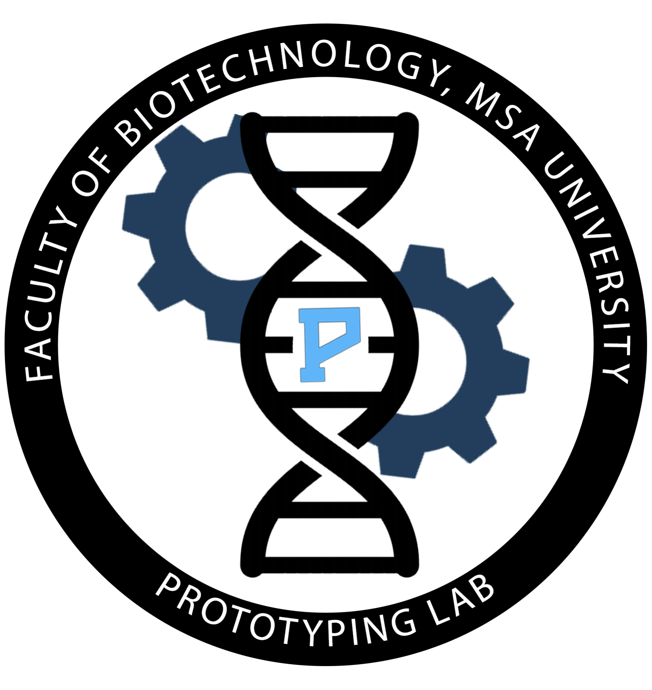

# RoboDoc v1 - Injury Segmentation & Analysis

<div align="center">
  
</div>


<div align="center">
  
  
  
  
</div>

**RoboDoc v1** is the first version in the complete RoboDoc project series (7 versions total), focusing on automated medical injury detection and segmentation using computer vision techniques.

<div align="center">
  
</div>

## 🎥 Demo Video

## Demo Video

<div align="center">
  
  <br><br>
  <em>RoboDoc v1 demonstration showing automated injury detection and segmentation workflow</em>
  <br>
  <sub><a href="demo_video.mov">Download full-quality video (.mov)</a></sub>
</div>

## 🏛️ Affiliation

**MSA University**  
Faculty of Biotechnology  
Prototyping Lab  

**Authors:** Nehal Alaa, Nour Marwan, Radwa Kamal, Ahmed Gomaa  
**Date:** October 2023

## 🔬 Overview

RoboDoc v1 analyzes injury images by comparing them against healthy control regions from the same image, providing automated contour detection and boundary mapping for medical assessment.

### Key Features
- Interactive injury image upload and control region selection
- Real-time threshold and line density parameter adjustment  
- Automated contour detection using differential analysis
- Export capabilities for analysis results and isolated contours
- Professional medical interface designed for clinical use

## 📁 Repository Contents

```
robodoc-v1/
├── robodoc.py              # Main application
├── logo.png                # App logo
├── demo_video.mov          # Video demonstration
├── test_images/            # Sample test images
├── sample_results/         # Example output results
├── logos/                  # Affiliation logos
├── requirements.txt        # Dependencies
└── README.md              # This file
```

## 🚀 Quick Start

### Installation
```bash
pip install PyQt6>=6.0.0 opencv-python>=4.5.0 numpy>=1.19.0 Pillow>=8.0.0
```

### Run Application
```bash
python robodoc.py
```

## 📋 Usage Workflow

1. **Upload Injury Image** - Load medical image (PNG, JPG, JPEG, BMP, TIFF)
2. **Select Control Region** - Crop healthy area for comparison baseline
3. **Adjust Parameters** - Set sensitivity threshold (3-190) and line density (1-50)
4. **Analyze & Export** - Process image and save results

## 🖼️ Sample Results

The `sample_results/` folder contains example outputs showing:
- Original injury images
- Detected contour boundaries
- Line-mapped injury regions
- Isolated contour exports

Test the application with provided images in `test_images/` folder.

## 🛠️ Technical Details

### Core Algorithm
- **Differential Analysis**: Compares injury vs. healthy tissue regions
- **Gaussian Blur**: Noise reduction preprocessing
- **Contour Detection**: Boundary identification using OpenCV
- **Multi-panel Output**: Combined visualization of analysis stages

### System Requirements
- Python 3.8+
- OpenCV 4.5+
- PyQt6 6.0+
- NumPy 1.19+

## 🏥 Medical Applications

- Wound assessment and monitoring
- Burn analysis and documentation
- Skin lesion boundary mapping
- Post-surgical recovery tracking
- Medical research documentation

## 📊 RoboDoc Project Series

This is **Version 1 of 7** in the complete RoboDoc medical imaging project. Each version focuses on different aspects of medical image analysis and diagnostic assistance.


<div align="center">
  
  
  
  
</div>

<div align="center">
  <strong>🏥 MSA University - Faculty of Biotechnology - Prototyping Lab 🏥</strong>
  <br>
  <sub>October 2023 • RoboDoc Project v1/7</sub>
</div>
